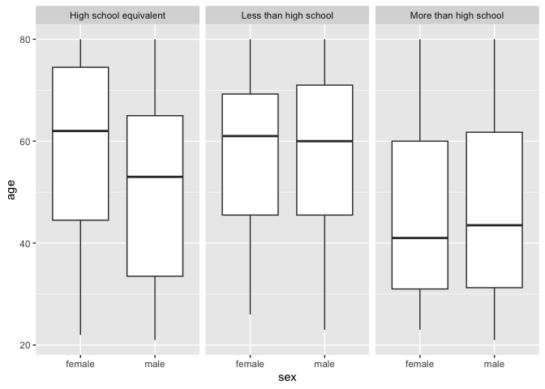
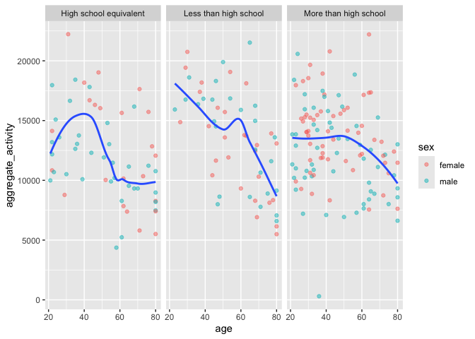
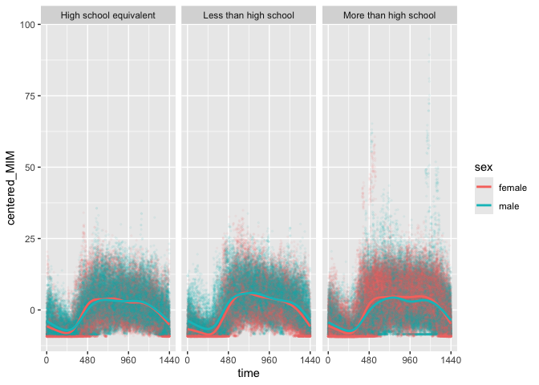

p8105 Hw#3
================
Kaylin De Silva
10-16-2024

**Problem 2**

\#loading libraries The following chunk loads the tidyverse and dplyr
libraries.

``` r
library(tidyverse)
```

    ## ── Attaching core tidyverse packages ──────────────────────── tidyverse 2.0.0 ──
    ## ✔ dplyr     1.1.4     ✔ readr     2.1.5
    ## ✔ forcats   1.0.0     ✔ stringr   1.5.1
    ## ✔ ggplot2   3.5.1     ✔ tibble    3.2.1
    ## ✔ lubridate 1.9.3     ✔ tidyr     1.3.1
    ## ✔ purrr     1.0.2     
    ## ── Conflicts ────────────────────────────────────────── tidyverse_conflicts() ──
    ## ✖ dplyr::filter() masks stats::filter()
    ## ✖ dplyr::lag()    masks stats::lag()
    ## ℹ Use the conflicted package (<http://conflicted.r-lib.org/>) to force all conflicts to become errors

``` r
library(dplyr)
```

\#loading and cleaning data set The following chunk uses a relative path
to load the two data sets for this problem, uses the head function to
take a look at the data, and then uses a function from the janitor
package to clean up variable names.

``` r
accel_df = read_csv(file = "./nhanes_accel.csv")
```

    ## Rows: 250 Columns: 1441
    ## ── Column specification ────────────────────────────────────────────────────────
    ## Delimiter: ","
    ## dbl (1441): SEQN, min1, min2, min3, min4, min5, min6, min7, min8, min9, min1...
    ## 
    ## ℹ Use `spec()` to retrieve the full column specification for this data.
    ## ℹ Specify the column types or set `show_col_types = FALSE` to quiet this message.

``` r
covar_df = read_csv(file = "./nhanes_covar.csv")
```

    ## New names:
    ## Rows: 254 Columns: 5
    ## ── Column specification
    ## ──────────────────────────────────────────────────────── Delimiter: "," chr
    ## (5): ...1, 1 = male, ...3, ...4, 1 = Less than high school
    ## ℹ Use `spec()` to retrieve the full column specification for this data. ℹ
    ## Specify the column types or set `show_col_types = FALSE` to quiet this message.
    ## • `` -> `...1`
    ## • `` -> `...3`
    ## • `` -> `...4`

``` r
head(accel_df)
```

    ## # A tibble: 6 × 1,441
    ##    SEQN  min1  min2  min3  min4   min5   min6  min7   min8    min9  min10  min11
    ##   <dbl> <dbl> <dbl> <dbl> <dbl>  <dbl>  <dbl> <dbl>  <dbl>   <dbl>  <dbl>  <dbl>
    ## 1 62161 1.11  3.12  1.47  0.938 1.60   0.145  2.10  0.509   1.63   1.20   0.947 
    ## 2 62164 1.92  1.67  2.38  0.935 2.59   5.22   2.39  4.90    1.97   3.13   2.77  
    ## 3 62169 5.85  5.18  4.76  6.48  6.85   7.24   6.12  7.48    5.47   6.49   5.14  
    ## 4 62174 5.42  3.48  3.72  3.81  6.85   4.45   0.561 1.61    0.698  2.72   4.85  
    ## 5 62177 6.14  8.06  9.99  6.60  4.57   2.78   7.10  7.25   10.1    7.49   2.72  
    ## 6 62178 0.167 0.429 0.131 1.20  0.0796 0.0487 0.106 0.0653  0.0564 0.0639 0.0909
    ## # ℹ 1,429 more variables: min12 <dbl>, min13 <dbl>, min14 <dbl>, min15 <dbl>,
    ## #   min16 <dbl>, min17 <dbl>, min18 <dbl>, min19 <dbl>, min20 <dbl>,
    ## #   min21 <dbl>, min22 <dbl>, min23 <dbl>, min24 <dbl>, min25 <dbl>,
    ## #   min26 <dbl>, min27 <dbl>, min28 <dbl>, min29 <dbl>, min30 <dbl>,
    ## #   min31 <dbl>, min32 <dbl>, min33 <dbl>, min34 <dbl>, min35 <dbl>,
    ## #   min36 <dbl>, min37 <dbl>, min38 <dbl>, min39 <dbl>, min40 <dbl>,
    ## #   min41 <dbl>, min42 <dbl>, min43 <dbl>, min44 <dbl>, min45 <dbl>, …

``` r
head(covar_df)
```

    ## # A tibble: 6 × 5
    ##   ...1  `1 = male` ...3  ...4  `1 = Less than high school`
    ##   <chr> <chr>      <chr> <chr> <chr>                      
    ## 1 <NA>  2 = female <NA>  <NA>  2 =  High school equivalent
    ## 2 <NA>  <NA>       <NA>  <NA>  3  = More than high school 
    ## 3 <NA>  <NA>       <NA>  <NA>  <NA>                       
    ## 4 SEQN  sex        age   BMI   education                  
    ## 5 62161 1          22    23.3  2                          
    ## 6 62164 2          44    23.2  3

``` r
accel_df = janitor :: clean_names(accel_df)
covar_df = janitor :: clean_names(covar_df)
```

\#renaming variables in covar_df The following chunk renames the
variables to appropriately capture what the data is describing in covar,
while also dropping NA and removing the first row.

``` r
colnames(covar_df)
```

    ## [1] "x1"                       "x1_male"                 
    ## [3] "x3"                       "x4"                      
    ## [5] "x1_less_than_high_school"

``` r
clean_covar_df = covar_df|>
  drop_na()|>
    rename(seqn = x1, sex = x1_male, age = x3, bmi = x4, education = x1_less_than_high_school)|>
        slice(-1) |>
  mutate(
      sex= as.numeric(sex),
      education = as.numeric(education))|>
      mutate(
        sex=
            case_match(
             sex,
              1 ~ "male",
              2 ~ "female"),
        education=
            case_match(
             education,
              1 ~ "Less than high school",
              2 ~ "High school equivalent",
              3 ~ "More than high school"),
          ) |>
  mutate_all(as.character)

    
clean_covar_df
```

    ## # A tibble: 229 × 5
    ##    seqn  sex    age   bmi   education             
    ##    <chr> <chr>  <chr> <chr> <chr>                 
    ##  1 62161 male   22    23.3  High school equivalent
    ##  2 62164 female 44    23.2  More than high school 
    ##  3 62169 male   21    20.1  High school equivalent
    ##  4 62174 male   80    33.9  More than high school 
    ##  5 62177 male   51    20.1  High school equivalent
    ##  6 62178 male   80    28.5  High school equivalent
    ##  7 62180 male   35    27.9  More than high school 
    ##  8 62184 male   26    22.1  High school equivalent
    ##  9 62189 female 30    22.4  More than high school 
    ## 10 62199 male   57    28    More than high school 
    ## # ℹ 219 more rows

\#categorizing SEQN variable in accel_df into a chr so that data sets
can be merged The following chunk drops NA for the accel_df and mutates
all variables to character variables so they are non-numeric and the
dataset can be merged with the covar_df.

``` r
colnames(accel_df)
```

    ##    [1] "seqn"    "min1"    "min2"    "min3"    "min4"    "min5"    "min6"   
    ##    [8] "min7"    "min8"    "min9"    "min10"   "min11"   "min12"   "min13"  
    ##   [15] "min14"   "min15"   "min16"   "min17"   "min18"   "min19"   "min20"  
    ##   [22] "min21"   "min22"   "min23"   "min24"   "min25"   "min26"   "min27"  
    ##   [29] "min28"   "min29"   "min30"   "min31"   "min32"   "min33"   "min34"  
    ##   [36] "min35"   "min36"   "min37"   "min38"   "min39"   "min40"   "min41"  
    ##   [43] "min42"   "min43"   "min44"   "min45"   "min46"   "min47"   "min48"  
    ##   [50] "min49"   "min50"   "min51"   "min52"   "min53"   "min54"   "min55"  
    ##   [57] "min56"   "min57"   "min58"   "min59"   "min60"   "min61"   "min62"  
    ##   [64] "min63"   "min64"   "min65"   "min66"   "min67"   "min68"   "min69"  
    ##   [71] "min70"   "min71"   "min72"   "min73"   "min74"   "min75"   "min76"  
    ##   [78] "min77"   "min78"   "min79"   "min80"   "min81"   "min82"   "min83"  
    ##   [85] "min84"   "min85"   "min86"   "min87"   "min88"   "min89"   "min90"  
    ##   [92] "min91"   "min92"   "min93"   "min94"   "min95"   "min96"   "min97"  
    ##   [99] "min98"   "min99"   "min100"  "min101"  "min102"  "min103"  "min104" 
    ##  [106] "min105"  "min106"  "min107"  "min108"  "min109"  "min110"  "min111" 
    ##  [113] "min112"  "min113"  "min114"  "min115"  "min116"  "min117"  "min118" 
    ##  [120] "min119"  "min120"  "min121"  "min122"  "min123"  "min124"  "min125" 
    ##  [127] "min126"  "min127"  "min128"  "min129"  "min130"  "min131"  "min132" 
    ##  [134] "min133"  "min134"  "min135"  "min136"  "min137"  "min138"  "min139" 
    ##  [141] "min140"  "min141"  "min142"  "min143"  "min144"  "min145"  "min146" 
    ##  [148] "min147"  "min148"  "min149"  "min150"  "min151"  "min152"  "min153" 
    ##  [155] "min154"  "min155"  "min156"  "min157"  "min158"  "min159"  "min160" 
    ##  [162] "min161"  "min162"  "min163"  "min164"  "min165"  "min166"  "min167" 
    ##  [169] "min168"  "min169"  "min170"  "min171"  "min172"  "min173"  "min174" 
    ##  [176] "min175"  "min176"  "min177"  "min178"  "min179"  "min180"  "min181" 
    ##  [183] "min182"  "min183"  "min184"  "min185"  "min186"  "min187"  "min188" 
    ##  [190] "min189"  "min190"  "min191"  "min192"  "min193"  "min194"  "min195" 
    ##  [197] "min196"  "min197"  "min198"  "min199"  "min200"  "min201"  "min202" 
    ##  [204] "min203"  "min204"  "min205"  "min206"  "min207"  "min208"  "min209" 
    ##  [211] "min210"  "min211"  "min212"  "min213"  "min214"  "min215"  "min216" 
    ##  [218] "min217"  "min218"  "min219"  "min220"  "min221"  "min222"  "min223" 
    ##  [225] "min224"  "min225"  "min226"  "min227"  "min228"  "min229"  "min230" 
    ##  [232] "min231"  "min232"  "min233"  "min234"  "min235"  "min236"  "min237" 
    ##  [239] "min238"  "min239"  "min240"  "min241"  "min242"  "min243"  "min244" 
    ##  [246] "min245"  "min246"  "min247"  "min248"  "min249"  "min250"  "min251" 
    ##  [253] "min252"  "min253"  "min254"  "min255"  "min256"  "min257"  "min258" 
    ##  [260] "min259"  "min260"  "min261"  "min262"  "min263"  "min264"  "min265" 
    ##  [267] "min266"  "min267"  "min268"  "min269"  "min270"  "min271"  "min272" 
    ##  [274] "min273"  "min274"  "min275"  "min276"  "min277"  "min278"  "min279" 
    ##  [281] "min280"  "min281"  "min282"  "min283"  "min284"  "min285"  "min286" 
    ##  [288] "min287"  "min288"  "min289"  "min290"  "min291"  "min292"  "min293" 
    ##  [295] "min294"  "min295"  "min296"  "min297"  "min298"  "min299"  "min300" 
    ##  [302] "min301"  "min302"  "min303"  "min304"  "min305"  "min306"  "min307" 
    ##  [309] "min308"  "min309"  "min310"  "min311"  "min312"  "min313"  "min314" 
    ##  [316] "min315"  "min316"  "min317"  "min318"  "min319"  "min320"  "min321" 
    ##  [323] "min322"  "min323"  "min324"  "min325"  "min326"  "min327"  "min328" 
    ##  [330] "min329"  "min330"  "min331"  "min332"  "min333"  "min334"  "min335" 
    ##  [337] "min336"  "min337"  "min338"  "min339"  "min340"  "min341"  "min342" 
    ##  [344] "min343"  "min344"  "min345"  "min346"  "min347"  "min348"  "min349" 
    ##  [351] "min350"  "min351"  "min352"  "min353"  "min354"  "min355"  "min356" 
    ##  [358] "min357"  "min358"  "min359"  "min360"  "min361"  "min362"  "min363" 
    ##  [365] "min364"  "min365"  "min366"  "min367"  "min368"  "min369"  "min370" 
    ##  [372] "min371"  "min372"  "min373"  "min374"  "min375"  "min376"  "min377" 
    ##  [379] "min378"  "min379"  "min380"  "min381"  "min382"  "min383"  "min384" 
    ##  [386] "min385"  "min386"  "min387"  "min388"  "min389"  "min390"  "min391" 
    ##  [393] "min392"  "min393"  "min394"  "min395"  "min396"  "min397"  "min398" 
    ##  [400] "min399"  "min400"  "min401"  "min402"  "min403"  "min404"  "min405" 
    ##  [407] "min406"  "min407"  "min408"  "min409"  "min410"  "min411"  "min412" 
    ##  [414] "min413"  "min414"  "min415"  "min416"  "min417"  "min418"  "min419" 
    ##  [421] "min420"  "min421"  "min422"  "min423"  "min424"  "min425"  "min426" 
    ##  [428] "min427"  "min428"  "min429"  "min430"  "min431"  "min432"  "min433" 
    ##  [435] "min434"  "min435"  "min436"  "min437"  "min438"  "min439"  "min440" 
    ##  [442] "min441"  "min442"  "min443"  "min444"  "min445"  "min446"  "min447" 
    ##  [449] "min448"  "min449"  "min450"  "min451"  "min452"  "min453"  "min454" 
    ##  [456] "min455"  "min456"  "min457"  "min458"  "min459"  "min460"  "min461" 
    ##  [463] "min462"  "min463"  "min464"  "min465"  "min466"  "min467"  "min468" 
    ##  [470] "min469"  "min470"  "min471"  "min472"  "min473"  "min474"  "min475" 
    ##  [477] "min476"  "min477"  "min478"  "min479"  "min480"  "min481"  "min482" 
    ##  [484] "min483"  "min484"  "min485"  "min486"  "min487"  "min488"  "min489" 
    ##  [491] "min490"  "min491"  "min492"  "min493"  "min494"  "min495"  "min496" 
    ##  [498] "min497"  "min498"  "min499"  "min500"  "min501"  "min502"  "min503" 
    ##  [505] "min504"  "min505"  "min506"  "min507"  "min508"  "min509"  "min510" 
    ##  [512] "min511"  "min512"  "min513"  "min514"  "min515"  "min516"  "min517" 
    ##  [519] "min518"  "min519"  "min520"  "min521"  "min522"  "min523"  "min524" 
    ##  [526] "min525"  "min526"  "min527"  "min528"  "min529"  "min530"  "min531" 
    ##  [533] "min532"  "min533"  "min534"  "min535"  "min536"  "min537"  "min538" 
    ##  [540] "min539"  "min540"  "min541"  "min542"  "min543"  "min544"  "min545" 
    ##  [547] "min546"  "min547"  "min548"  "min549"  "min550"  "min551"  "min552" 
    ##  [554] "min553"  "min554"  "min555"  "min556"  "min557"  "min558"  "min559" 
    ##  [561] "min560"  "min561"  "min562"  "min563"  "min564"  "min565"  "min566" 
    ##  [568] "min567"  "min568"  "min569"  "min570"  "min571"  "min572"  "min573" 
    ##  [575] "min574"  "min575"  "min576"  "min577"  "min578"  "min579"  "min580" 
    ##  [582] "min581"  "min582"  "min583"  "min584"  "min585"  "min586"  "min587" 
    ##  [589] "min588"  "min589"  "min590"  "min591"  "min592"  "min593"  "min594" 
    ##  [596] "min595"  "min596"  "min597"  "min598"  "min599"  "min600"  "min601" 
    ##  [603] "min602"  "min603"  "min604"  "min605"  "min606"  "min607"  "min608" 
    ##  [610] "min609"  "min610"  "min611"  "min612"  "min613"  "min614"  "min615" 
    ##  [617] "min616"  "min617"  "min618"  "min619"  "min620"  "min621"  "min622" 
    ##  [624] "min623"  "min624"  "min625"  "min626"  "min627"  "min628"  "min629" 
    ##  [631] "min630"  "min631"  "min632"  "min633"  "min634"  "min635"  "min636" 
    ##  [638] "min637"  "min638"  "min639"  "min640"  "min641"  "min642"  "min643" 
    ##  [645] "min644"  "min645"  "min646"  "min647"  "min648"  "min649"  "min650" 
    ##  [652] "min651"  "min652"  "min653"  "min654"  "min655"  "min656"  "min657" 
    ##  [659] "min658"  "min659"  "min660"  "min661"  "min662"  "min663"  "min664" 
    ##  [666] "min665"  "min666"  "min667"  "min668"  "min669"  "min670"  "min671" 
    ##  [673] "min672"  "min673"  "min674"  "min675"  "min676"  "min677"  "min678" 
    ##  [680] "min679"  "min680"  "min681"  "min682"  "min683"  "min684"  "min685" 
    ##  [687] "min686"  "min687"  "min688"  "min689"  "min690"  "min691"  "min692" 
    ##  [694] "min693"  "min694"  "min695"  "min696"  "min697"  "min698"  "min699" 
    ##  [701] "min700"  "min701"  "min702"  "min703"  "min704"  "min705"  "min706" 
    ##  [708] "min707"  "min708"  "min709"  "min710"  "min711"  "min712"  "min713" 
    ##  [715] "min714"  "min715"  "min716"  "min717"  "min718"  "min719"  "min720" 
    ##  [722] "min721"  "min722"  "min723"  "min724"  "min725"  "min726"  "min727" 
    ##  [729] "min728"  "min729"  "min730"  "min731"  "min732"  "min733"  "min734" 
    ##  [736] "min735"  "min736"  "min737"  "min738"  "min739"  "min740"  "min741" 
    ##  [743] "min742"  "min743"  "min744"  "min745"  "min746"  "min747"  "min748" 
    ##  [750] "min749"  "min750"  "min751"  "min752"  "min753"  "min754"  "min755" 
    ##  [757] "min756"  "min757"  "min758"  "min759"  "min760"  "min761"  "min762" 
    ##  [764] "min763"  "min764"  "min765"  "min766"  "min767"  "min768"  "min769" 
    ##  [771] "min770"  "min771"  "min772"  "min773"  "min774"  "min775"  "min776" 
    ##  [778] "min777"  "min778"  "min779"  "min780"  "min781"  "min782"  "min783" 
    ##  [785] "min784"  "min785"  "min786"  "min787"  "min788"  "min789"  "min790" 
    ##  [792] "min791"  "min792"  "min793"  "min794"  "min795"  "min796"  "min797" 
    ##  [799] "min798"  "min799"  "min800"  "min801"  "min802"  "min803"  "min804" 
    ##  [806] "min805"  "min806"  "min807"  "min808"  "min809"  "min810"  "min811" 
    ##  [813] "min812"  "min813"  "min814"  "min815"  "min816"  "min817"  "min818" 
    ##  [820] "min819"  "min820"  "min821"  "min822"  "min823"  "min824"  "min825" 
    ##  [827] "min826"  "min827"  "min828"  "min829"  "min830"  "min831"  "min832" 
    ##  [834] "min833"  "min834"  "min835"  "min836"  "min837"  "min838"  "min839" 
    ##  [841] "min840"  "min841"  "min842"  "min843"  "min844"  "min845"  "min846" 
    ##  [848] "min847"  "min848"  "min849"  "min850"  "min851"  "min852"  "min853" 
    ##  [855] "min854"  "min855"  "min856"  "min857"  "min858"  "min859"  "min860" 
    ##  [862] "min861"  "min862"  "min863"  "min864"  "min865"  "min866"  "min867" 
    ##  [869] "min868"  "min869"  "min870"  "min871"  "min872"  "min873"  "min874" 
    ##  [876] "min875"  "min876"  "min877"  "min878"  "min879"  "min880"  "min881" 
    ##  [883] "min882"  "min883"  "min884"  "min885"  "min886"  "min887"  "min888" 
    ##  [890] "min889"  "min890"  "min891"  "min892"  "min893"  "min894"  "min895" 
    ##  [897] "min896"  "min897"  "min898"  "min899"  "min900"  "min901"  "min902" 
    ##  [904] "min903"  "min904"  "min905"  "min906"  "min907"  "min908"  "min909" 
    ##  [911] "min910"  "min911"  "min912"  "min913"  "min914"  "min915"  "min916" 
    ##  [918] "min917"  "min918"  "min919"  "min920"  "min921"  "min922"  "min923" 
    ##  [925] "min924"  "min925"  "min926"  "min927"  "min928"  "min929"  "min930" 
    ##  [932] "min931"  "min932"  "min933"  "min934"  "min935"  "min936"  "min937" 
    ##  [939] "min938"  "min939"  "min940"  "min941"  "min942"  "min943"  "min944" 
    ##  [946] "min945"  "min946"  "min947"  "min948"  "min949"  "min950"  "min951" 
    ##  [953] "min952"  "min953"  "min954"  "min955"  "min956"  "min957"  "min958" 
    ##  [960] "min959"  "min960"  "min961"  "min962"  "min963"  "min964"  "min965" 
    ##  [967] "min966"  "min967"  "min968"  "min969"  "min970"  "min971"  "min972" 
    ##  [974] "min973"  "min974"  "min975"  "min976"  "min977"  "min978"  "min979" 
    ##  [981] "min980"  "min981"  "min982"  "min983"  "min984"  "min985"  "min986" 
    ##  [988] "min987"  "min988"  "min989"  "min990"  "min991"  "min992"  "min993" 
    ##  [995] "min994"  "min995"  "min996"  "min997"  "min998"  "min999"  "min1000"
    ## [1002] "min1001" "min1002" "min1003" "min1004" "min1005" "min1006" "min1007"
    ## [1009] "min1008" "min1009" "min1010" "min1011" "min1012" "min1013" "min1014"
    ## [1016] "min1015" "min1016" "min1017" "min1018" "min1019" "min1020" "min1021"
    ## [1023] "min1022" "min1023" "min1024" "min1025" "min1026" "min1027" "min1028"
    ## [1030] "min1029" "min1030" "min1031" "min1032" "min1033" "min1034" "min1035"
    ## [1037] "min1036" "min1037" "min1038" "min1039" "min1040" "min1041" "min1042"
    ## [1044] "min1043" "min1044" "min1045" "min1046" "min1047" "min1048" "min1049"
    ## [1051] "min1050" "min1051" "min1052" "min1053" "min1054" "min1055" "min1056"
    ## [1058] "min1057" "min1058" "min1059" "min1060" "min1061" "min1062" "min1063"
    ## [1065] "min1064" "min1065" "min1066" "min1067" "min1068" "min1069" "min1070"
    ## [1072] "min1071" "min1072" "min1073" "min1074" "min1075" "min1076" "min1077"
    ## [1079] "min1078" "min1079" "min1080" "min1081" "min1082" "min1083" "min1084"
    ## [1086] "min1085" "min1086" "min1087" "min1088" "min1089" "min1090" "min1091"
    ## [1093] "min1092" "min1093" "min1094" "min1095" "min1096" "min1097" "min1098"
    ## [1100] "min1099" "min1100" "min1101" "min1102" "min1103" "min1104" "min1105"
    ## [1107] "min1106" "min1107" "min1108" "min1109" "min1110" "min1111" "min1112"
    ## [1114] "min1113" "min1114" "min1115" "min1116" "min1117" "min1118" "min1119"
    ## [1121] "min1120" "min1121" "min1122" "min1123" "min1124" "min1125" "min1126"
    ## [1128] "min1127" "min1128" "min1129" "min1130" "min1131" "min1132" "min1133"
    ## [1135] "min1134" "min1135" "min1136" "min1137" "min1138" "min1139" "min1140"
    ## [1142] "min1141" "min1142" "min1143" "min1144" "min1145" "min1146" "min1147"
    ## [1149] "min1148" "min1149" "min1150" "min1151" "min1152" "min1153" "min1154"
    ## [1156] "min1155" "min1156" "min1157" "min1158" "min1159" "min1160" "min1161"
    ## [1163] "min1162" "min1163" "min1164" "min1165" "min1166" "min1167" "min1168"
    ## [1170] "min1169" "min1170" "min1171" "min1172" "min1173" "min1174" "min1175"
    ## [1177] "min1176" "min1177" "min1178" "min1179" "min1180" "min1181" "min1182"
    ## [1184] "min1183" "min1184" "min1185" "min1186" "min1187" "min1188" "min1189"
    ## [1191] "min1190" "min1191" "min1192" "min1193" "min1194" "min1195" "min1196"
    ## [1198] "min1197" "min1198" "min1199" "min1200" "min1201" "min1202" "min1203"
    ## [1205] "min1204" "min1205" "min1206" "min1207" "min1208" "min1209" "min1210"
    ## [1212] "min1211" "min1212" "min1213" "min1214" "min1215" "min1216" "min1217"
    ## [1219] "min1218" "min1219" "min1220" "min1221" "min1222" "min1223" "min1224"
    ## [1226] "min1225" "min1226" "min1227" "min1228" "min1229" "min1230" "min1231"
    ## [1233] "min1232" "min1233" "min1234" "min1235" "min1236" "min1237" "min1238"
    ## [1240] "min1239" "min1240" "min1241" "min1242" "min1243" "min1244" "min1245"
    ## [1247] "min1246" "min1247" "min1248" "min1249" "min1250" "min1251" "min1252"
    ## [1254] "min1253" "min1254" "min1255" "min1256" "min1257" "min1258" "min1259"
    ## [1261] "min1260" "min1261" "min1262" "min1263" "min1264" "min1265" "min1266"
    ## [1268] "min1267" "min1268" "min1269" "min1270" "min1271" "min1272" "min1273"
    ## [1275] "min1274" "min1275" "min1276" "min1277" "min1278" "min1279" "min1280"
    ## [1282] "min1281" "min1282" "min1283" "min1284" "min1285" "min1286" "min1287"
    ## [1289] "min1288" "min1289" "min1290" "min1291" "min1292" "min1293" "min1294"
    ## [1296] "min1295" "min1296" "min1297" "min1298" "min1299" "min1300" "min1301"
    ## [1303] "min1302" "min1303" "min1304" "min1305" "min1306" "min1307" "min1308"
    ## [1310] "min1309" "min1310" "min1311" "min1312" "min1313" "min1314" "min1315"
    ## [1317] "min1316" "min1317" "min1318" "min1319" "min1320" "min1321" "min1322"
    ## [1324] "min1323" "min1324" "min1325" "min1326" "min1327" "min1328" "min1329"
    ## [1331] "min1330" "min1331" "min1332" "min1333" "min1334" "min1335" "min1336"
    ## [1338] "min1337" "min1338" "min1339" "min1340" "min1341" "min1342" "min1343"
    ## [1345] "min1344" "min1345" "min1346" "min1347" "min1348" "min1349" "min1350"
    ## [1352] "min1351" "min1352" "min1353" "min1354" "min1355" "min1356" "min1357"
    ## [1359] "min1358" "min1359" "min1360" "min1361" "min1362" "min1363" "min1364"
    ## [1366] "min1365" "min1366" "min1367" "min1368" "min1369" "min1370" "min1371"
    ## [1373] "min1372" "min1373" "min1374" "min1375" "min1376" "min1377" "min1378"
    ## [1380] "min1379" "min1380" "min1381" "min1382" "min1383" "min1384" "min1385"
    ## [1387] "min1386" "min1387" "min1388" "min1389" "min1390" "min1391" "min1392"
    ## [1394] "min1393" "min1394" "min1395" "min1396" "min1397" "min1398" "min1399"
    ## [1401] "min1400" "min1401" "min1402" "min1403" "min1404" "min1405" "min1406"
    ## [1408] "min1407" "min1408" "min1409" "min1410" "min1411" "min1412" "min1413"
    ## [1415] "min1414" "min1415" "min1416" "min1417" "min1418" "min1419" "min1420"
    ## [1422] "min1421" "min1422" "min1423" "min1424" "min1425" "min1426" "min1427"
    ## [1429] "min1428" "min1429" "min1430" "min1431" "min1432" "min1433" "min1434"
    ## [1436] "min1435" "min1436" "min1437" "min1438" "min1439" "min1440"

``` r
clean_accel_df = accel_df |>
      drop_na()|>
        mutate_all(as.character)
clean_accel_df
```

    ## # A tibble: 250 × 1,441
    ##    seqn  min1  min2  min3  min4  min5  min6  min7  min8  min9  min10 min11 min12
    ##    <chr> <chr> <chr> <chr> <chr> <chr> <chr> <chr> <chr> <chr> <chr> <chr> <chr>
    ##  1 62161 1.106 3.11… 1.46… 0.93… 1.59… 0.14… 2.10… 0.50… 1.63… 1.19… 0.94… 0.02…
    ##  2 62164 1.92… 1.66… 2.376 0.93… 2.59… 5.22… 2.39… 4.90… 1.96… 3.134 2.77… 2.45…
    ##  3 62169 5.84… 5.17… 4.76… 6.482 6.85… 7.24… 6.11… 7.48… 5.47… 6.49… 5.13… 3.51…
    ##  4 62174 5.421 3.48… 3.71… 3.80… 6.85… 4.44… 0.56… 1.608 0.69… 2.72… 4.84… 0.57…
    ##  5 62177 6.14… 8.05… 9.99… 6.59… 4.571 2.78… 7.10… 7.25… 10.1… 7.49… 2.718 2.39…
    ##  6 62178 0.16… 0.42… 0.13… 1.20… 0.07… 0.04… 0.10… 0.06… 0.05… 0.06… 0.09… 0.03…
    ##  7 62180 0.039 0     0     0     0.36… 0.265 0.50… 0.63… 0     0.011 1.09… 2.39…
    ##  8 62184 1.54… 2.81… 3.86… 4.75… 6.104 7.61… 4.73… 6.73… 5.42… 4.24… 5.15… 3.95…
    ##  9 62186 3.07… 2.54… 2.62… 2.119 1.14… 1.68… 2.84… 2.72… 2.12… 2.182 2.28… 2.03…
    ## 10 62189 2.81… 0.19… 0.16… 0     0.14… 0.18… 0.86… 0.21… 0     0     0     0.494
    ## # ℹ 240 more rows
    ## # ℹ 1,428 more variables: min13 <chr>, min14 <chr>, min15 <chr>, min16 <chr>,
    ## #   min17 <chr>, min18 <chr>, min19 <chr>, min20 <chr>, min21 <chr>,
    ## #   min22 <chr>, min23 <chr>, min24 <chr>, min25 <chr>, min26 <chr>,
    ## #   min27 <chr>, min28 <chr>, min29 <chr>, min30 <chr>, min31 <chr>,
    ## #   min32 <chr>, min33 <chr>, min34 <chr>, min35 <chr>, min36 <chr>,
    ## #   min37 <chr>, min38 <chr>, min39 <chr>, min40 <chr>, min41 <chr>, …

\#merging data sets The following chunk merges the data set by variable
SEQN and filters out observations where age is less than 21.

``` r
nhanes_df = inner_join(clean_covar_df, clean_accel_df, by = "seqn") |>
  filter(
      age>=21
  )
nhanes_df
```

    ## # A tibble: 228 × 1,445
    ##    seqn  sex    age   bmi   education  min1  min2  min3  min4  min5  min6  min7 
    ##    <chr> <chr>  <chr> <chr> <chr>      <chr> <chr> <chr> <chr> <chr> <chr> <chr>
    ##  1 62161 male   22    23.3  High scho… 1.106 3.11… 1.46… 0.93… 1.59… 0.14… 2.10…
    ##  2 62164 female 44    23.2  More than… 1.92… 1.66… 2.376 0.93… 2.59… 5.22… 2.39…
    ##  3 62169 male   21    20.1  High scho… 5.84… 5.17… 4.76… 6.482 6.85… 7.24… 6.11…
    ##  4 62174 male   80    33.9  More than… 5.421 3.48… 3.71… 3.80… 6.85… 4.44… 0.56…
    ##  5 62177 male   51    20.1  High scho… 6.14… 8.05… 9.99… 6.59… 4.571 2.78… 7.10…
    ##  6 62178 male   80    28.5  High scho… 0.16… 0.42… 0.13… 1.20… 0.07… 0.04… 0.10…
    ##  7 62180 male   35    27.9  More than… 0.039 0     0     0     0.36… 0.265 0.50…
    ##  8 62184 male   26    22.1  High scho… 1.54… 2.81… 3.86… 4.75… 6.104 7.61… 4.73…
    ##  9 62189 female 30    22.4  More than… 2.81… 0.19… 0.16… 0     0.14… 0.18… 0.86…
    ## 10 62199 male   57    28    More than… 0.031 0.03… 0.03… 0.079 0.10… 0.26… 0.87…
    ## # ℹ 218 more rows
    ## # ℹ 1,433 more variables: min8 <chr>, min9 <chr>, min10 <chr>, min11 <chr>,
    ## #   min12 <chr>, min13 <chr>, min14 <chr>, min15 <chr>, min16 <chr>,
    ## #   min17 <chr>, min18 <chr>, min19 <chr>, min20 <chr>, min21 <chr>,
    ## #   min22 <chr>, min23 <chr>, min24 <chr>, min25 <chr>, min26 <chr>,
    ## #   min27 <chr>, min28 <chr>, min29 <chr>, min30 <chr>, min31 <chr>,
    ## #   min32 <chr>, min33 <chr>, min34 <chr>, min35 <chr>, min36 <chr>, …

\#creating a table for sex and education The following chunk creates a
reader-friendly table for the number of men and women in each education
category.

``` r
sex_education_df = nhanes_df |>
  select(education,sex) |>
  group_by(education, sex) |>
  count()

knitr::kable(sex_education_df)
```

| education              | sex    |   n |
|:-----------------------|:-------|----:|
| High school equivalent | female |  23 |
| High school equivalent | male   |  35 |
| Less than high school  | female |  28 |
| Less than high school  | male   |  27 |
| More than high school  | female |  59 |
| More than high school  | male   |  56 |

The table highlights that there are more males and females in the “More
than High School” education category than any other category. The least
amount of female participants can be found in the “High School
Equivalent” category, while the least amount of male participants can be
found in the “Less than High School” category.

\#creating a visualization  
The following chunk creates a data visualization for the age
distributions for men and women in each education category.Variables sex
and education are mutated into factor variables and age is mutated into
a numeric variable in order to create a visualization. A ggplot function
is used to create a boxplot of sex and age and a three-panel plot is
created based on the variable “education” through facet_wrap.

``` r
boxplot_df = nhanes_df |>
  select (education, sex, age) |>
  mutate(
    sex = as.factor(sex),
    education = as.factor(education),
    age = as.numeric(age))

ggplot(boxplot_df, aes(x = sex, y = age)) + 
  geom_boxplot() + 
  facet_wrap(~education)
```

<!-- --> The
box plots highlight that the median age of both female and male
participants is lowest for the “More than High School” category. For
female participants, the median age is relatively similar amongst those
in the “High School Equivalent” and “Less than High School” categories,
but the deviation is greater in the “High School Equivalent” category.
For male participants, the median age is higher amongst those in the
“Less than High School” category.

\#creating an aggregate variable and a plot comparing it to age for men
and women across education levels The following chunk creates an
aggregate activity variable by grouping observations by seqn and summing
their values across min1-min1440. This variable was added to the current
data set and age was mutated into a numeric variable to support its use
in the following ggplot. The ggplot plots aggregate activity as a
function of age, with colors indicating the sex of the participant and
three panels for the three education levels.

``` r
aggregate_activity_df = nhanes_df |>
  group_by(seqn) |>
  summarize(aggregate_activity = sum(min1:min1440, na.rm = TRUE), .groups = 'drop')

nhanes_df_aggregate <- nhanes_df |>
  left_join(aggregate_activity_df, by = "seqn") |>
  mutate(
    age = as.numeric(age))

nhanes_df_aggregate |> 
  ggplot(aes(y = aggregate_activity, x = age)) + 
  geom_point(aes(color = sex), alpha = .5) +
  geom_smooth(se = FALSE) +
  facet_wrap(.~education)
```

    ## `geom_smooth()` using method = 'loess' and formula = 'y ~ x'

<!-- -->
Comparing the plots and their trendlines, it is apparent that across
education levels aggregate activity generally decreases as age
increases. Amongst participants in the “More than High School” education
category, aggregate activity was highest on average at 40 years of age,
while it was highest around 20 years of age for the “High School
Equivalent”. The trend lines reflect a more consistent relationship
between age and aggregate activity amongst the “High School Equivalent”
group.

\#24 hour activity time courses The following chunk pivots the data in
order to plot MIM as a function of time by the minute. Creating a time
variable and dropping the prefix “min” allows for time to be used in the
ggplot(after mutating it to a numeric variable). After grouping
observations by sex, a variable called “centered_MIM” was created to
make a more consolidated graph (MIM values originally had a large
spread). This pivoted dataset was plotted (centered_MIM as a function of
time\[min\]) with color differences to indicate the two sex categories
and three panels for the education levels. The x axis scale was broken
up into four 8 hour intervals so the x-axis was not cluttered with the
original 1440 x-values.

``` r
nhanes_df_pivot = nhanes_df |>
  pivot_longer(
    min1:min1440,
    names_to = "time",
    names_prefix = "min",
    values_to = "MIM") |>
  group_by(sex) |>
  mutate(
    MIM = as.numeric(MIM),
    time = as.numeric(time))|>
  mutate(
    mean_MIM = mean(MIM, na.rm = TRUE),
    centered_MIM = MIM - mean_MIM) |>
  ungroup()
    

nhanes_df_pivot
```

    ## # A tibble: 328,320 × 9
    ##    seqn  sex   age   bmi   education            time   MIM mean_MIM centered_MIM
    ##    <chr> <chr> <chr> <chr> <chr>               <dbl> <dbl>    <dbl>        <dbl>
    ##  1 62161 male  22    23.3  High school equiva…     1 1.11      8.54        -7.43
    ##  2 62161 male  22    23.3  High school equiva…     2 3.12      8.54        -5.42
    ##  3 62161 male  22    23.3  High school equiva…     3 1.47      8.54        -7.07
    ##  4 62161 male  22    23.3  High school equiva…     4 0.938     8.54        -7.60
    ##  5 62161 male  22    23.3  High school equiva…     5 1.60      8.54        -6.94
    ##  6 62161 male  22    23.3  High school equiva…     6 0.145     8.54        -8.39
    ##  7 62161 male  22    23.3  High school equiva…     7 2.10      8.54        -6.44
    ##  8 62161 male  22    23.3  High school equiva…     8 0.509     8.54        -8.03
    ##  9 62161 male  22    23.3  High school equiva…     9 1.63      8.54        -6.91
    ## 10 62161 male  22    23.3  High school equiva…    10 1.20      8.54        -7.34
    ## # ℹ 328,310 more rows

``` r
nhanes_df_pivot|>
  ggplot(aes(x = time, y = centered_MIM)) + 
  geom_point(aes(color = sex), alpha = .05, size = .5) +
  facet_wrap(.~education) +
   scale_x_continuous(
    breaks = c(0, 480, 960, 1440)) +
    geom_smooth(aes(color=sex),se = FALSE) 
```

    ## `geom_smooth()` using method = 'gam' and formula = 'y ~ s(x, bs = "cs")'

<!-- -->

``` r
  labs(x = "Time (minutes)", y = "Centered MIM", color = "Sex")
```

    ## $x
    ## [1] "Time (minutes)"
    ## 
    ## $y
    ## [1] "Centered MIM"
    ## 
    ## $colour
    ## [1] "Sex"
    ## 
    ## attr(,"class")
    ## [1] "labels"

The trendlines reflect a lower amount activity in the first 8 hours of
the day (considering this is from 12:00am to 8:00am, this is
reasonable). The highest amount of activity for all three education
levels is between 8:00am and 4:00pm. Though men and women vary slightly
in their activity levels across education categories, their trends are
relatively similar within education categories.

**Problem 3**
